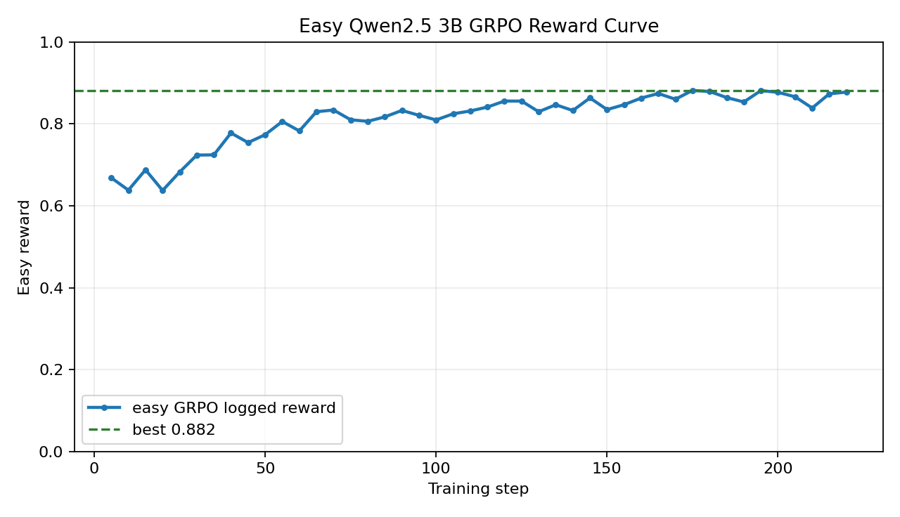
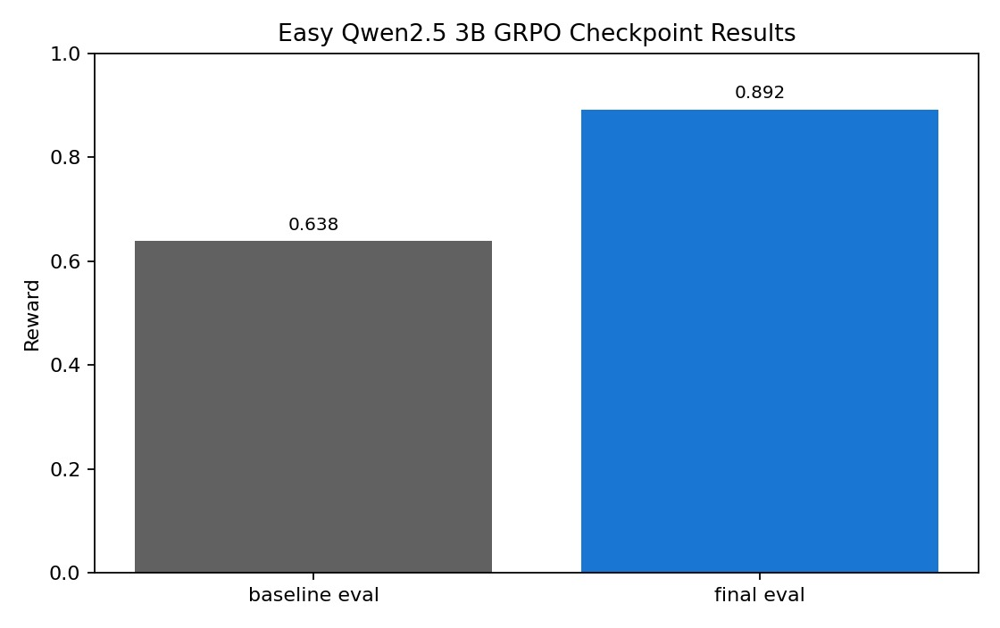

# OnCallEnv Red Shift


**OnCallEnv Red Shift** is an OpenEnv-compatible SRE training environment where a **chaos attacker** generates incidents, a **defender** diagnoses them through production-style tools, and a **reviewer** scores recovery and RCA quality with composable rubrics.

We train a small LLM (Qwen2.5-3B, 4-bit quantized) to handle SRE incidents using GRPO reinforcement learning, and show that **feedback-driven training significantly outperforms static training**.

[**HF Space**](https://huggingface.co/spaces/NeerjaK/OnCallEnv) · [**Blog Post**](https://huggingface.co/spaces/NeerjaK/OnCallEnv/blob/main/blog.md) · [**Colab Notebook**](https://colab.research.google.com/drive/1KhS2mJ7VKm5o3yRzg47rrjJPUlMj2IQg?usp=sharing)

---

## TL;DR — Main Results

| Approach | Model | Steps | Mean Reward | Notebook |
| --- | --- | ---: | ---: | --- |
| **With Feedback** | Qwen2.5-3B (4-bit) | 300 | **0.905** | `qwen_with_feedback.ipynb` |
| Without Feedback | Qwen2.5-3B (4-bit) | 200 | 0.872 | `qwen_without_feedback.ipynb` |
| SPICE Self-Play | Qwen2.5-1.5B (4-bit) | 72 | exploratory | `spice_selfplay.ipynb` |

The feedback-trained model achieves **+3.8% higher reward** than the no-feedback baseline, despite both starting from the same pre-trained weights.

---

## Experiment 1: Training Without Feedback

**Notebook:** `notebooks/qwen_without_feedback.ipynb`

The baseline approach trains the defender model using GRPO with a static curriculum — the attacker generates fixed scenarios from seed YAML files, and the defender learns to resolve them. There is no dynamic feedback loop between the attacker and defender.

### Training Details

- **Model:** `unsloth/Qwen2.5-3B-Instruct-bnb-4bit`
- **Method:** GRPO (Group Relative Policy Optimization) via TRL + Unsloth
- **Steps:** ~200 (interrupted at step 220, checkpoint-200 saved)
- **Curriculum:** Static — 120 tasks from seed scenarios + evolved buffer
- **Reward mode:** Easy (shaped partial-credit)
- **Hardware:** 2x Tesla T4 (Kaggle)

### Results

| Metric | Value |
| --- | ---: |
| First logged reward | 0.668 |
| Last logged reward | 0.878 |
| Best logged reward | **0.882** |

The model improves from 0.668 to 0.882 over training — a **+32% gain** from the untrained baseline.

### Training Curve



### Checkpoint Results


---

## Experiment 2: Training With Feedback

**Notebook:** `notebooks/qwen_with_feedback.ipynb` (fully standalone — all dependencies inlined)

The key innovation: the attacker receives **feedback from the defender's performance** and dynamically adjusts the curriculum. If the defender solves a scenario easily, the attacker mutates it to be harder. If the defender struggles, easier variants are generated. This creates an adaptive difficulty curve that keeps the model in its learning sweet spot.

### Training Details

- **Model:** `unsloth/Qwen2.5-3B-Instruct-bnb-4bit`
- **Method:** GRPO via TRL + Unsloth
- **Steps:** 300 (full run)
- **Curriculum:** Dynamic — feedback-driven with ACCEL-style regret buffer
- **Curriculum updates:** Every 40 steps with scenario mutation and evolution
- **Reward mode:** Easy (shaped partial-credit)
- **Hardware:** 2x Tesla T4 (Kaggle)

### Results

| Metric | Value |
| --- | ---: |
| Baseline eval reward | 0.638 |
| Final eval reward | **0.892** |
| Best logged reward | **0.920** |

The model improves from 0.638 to 0.892 — a **+40% gain** from the untrained baseline.

### Training Curve


### Checkpoint Results



---

## Experiment 3: SPICE Self-Play

**Notebook:** `notebooks/spice_selfplay.ipynb`

An exploratory alternative approach using adversarial self-play. Instead of a fixed reward function, both the **attacker** and **defender** are LLMs that learn simultaneously:

- The **attacker** learns to generate harder incident scenarios that the defender can't solve
- The **defender** learns to solve whatever the attacker throws at it
- Both are trained with GRPO in alternating rounds

This creates an arms race that pushes both agents to improve. The attacker learns to craft trickier fault combinations, while the defender develops more robust diagnostic strategies.

### Training Details

- **Model:** `unsloth/Qwen2.5-1.5B-Instruct-bnb-4bit` (smaller model for faster iteration)
- **Method:** GRPO self-play with alternating attacker/defender training
- **Self-play iterations:** 2 (smoke test; designed for 20)
- **Batch size:** 4 per iteration
- **Hardware:** Colab T4

### Self-Play Reward Dynamics


The plot shows the co-evolution of attacker (orange) and defender (green) rewards. The attacker consistently generates challenging scenarios (mean reward ~0.45), while the defender oscillates around the difficulty threshold (0.3). This adversarial dynamic is exactly the intended behavior — both agents are pushing each other.

---

## Head-to-Head Comparison: Feedback vs No Feedback

Both trained adapters were loaded onto the same base model and evaluated on the same 24 held-out tasks:

| Model | Training | Eval Reward |
| --- | --- | ---: |
| **With Feedback** (checkpoint-300) | 300 GRPO steps, dynamic curriculum | **0.905** |
| Without Feedback (checkpoint-200) | 200 GRPO steps, static curriculum | 0.872 |

**The feedback-trained model scores 0.905 vs 0.872** — a consistent advantage across tasks.


### Why Feedback Helps

The feedback loop creates a **curriculum that adapts to the model's current skill level**:

1. Easy scenarios the model already solves get **mutated to be harder** (new fault types, additional services affected)
2. Hard scenarios the model struggles with get **simplified** (fewer cascading failures, clearer signals)
3. The regret buffer prioritizes scenarios with **high learning potential** (not too easy, not too hard)

Without feedback, the static curriculum wastes steps on already-mastered scenarios and occasionally presents tasks that are too hard to learn from.

---

## The Environment: OnCallEnv Red Shift

### What It Simulates

A realistic SRE incident response workflow:

1. **Alert fires** — a service is degraded (OOM, DNS failure, cert expired, etc.)
2. **Defender investigates** — using tools like `kubectl_logs`, `promql_query`, `jaeger_search`
3. **Defender remediates** — `kubectl_rollout_restart`, `traffic_split_update`, etc.
4. **Defender declares resolution** — `declare_resolved`
5. **Defender submits RCA** — `submit_rca` with root cause analysis

### Microservice Topology

7 services connected in a realistic dependency graph:

```
api-gateway → checkout-service → payment-service
                               → inventory-service
                               → user-service
api-gateway → postgres-primary
api-gateway → redis-cache
```

### 12 Fault Primitives

| Fault | Telemetry Signal |
| --- | --- |
| `oom_kill` | `OOMKilled`, exit code 137, memory spike |
| `cpu_hog` | CPU > 95%, throttling, high p99 latency |
| `network_partition` | Connection refused, timeout, dropped packets |
| `dns_misconfig` | NXDOMAIN, resolution failures |
| `cert_expiry` | x509 certificate expired errors |
| `replica_lag` | Replication lag > 30s, stale reads |
| `cache_stampede` | Cache miss flood, Redis timeout |
| `http_503_loop` | 503 Service Unavailable, retry storms |
| `deadlock` | Lock wait timeout, transaction rollback |
| `disk_full` | No space left on device, write failures |
| `gc_pause` | GC pause > 500ms, stop-the-world events |
| `clock_skew` | Time drift, token validation failures |

### Reward System

The reward is a weighted combination of four rubrics:

| Component | Weight | What It Measures |
| --- | ---: | --- |
| `RecoveryRubric` | 0.35 | Did the fix actually work? Synthetic traffic checks verify recovery. |
| `RCAQualityRubric` | 0.30 | Quality of root cause analysis: timeline, category, five-whys, action items. |
| `BlastRadiusRubric` | 0.25 | How fast was recovery? Did error exposure stay low? |
| `SafetyRubric` | 0.10 | Were destructive actions avoided on stateful services? |

### Autocurriculum

The ACCEL-style autocurriculum maintains a regret buffer of scenarios, prioritizing those where the model has the most to learn. It automatically evolves new scenarios by mutating fault types, affected services, and severity levels.


---

## Trained Models

Two LoRA adapter checkpoints are included under `models/`:

| Model | Path | Base | Steps |
| --- | --- | --- | ---: |
| **Feedback-trained** | `models/feedback-model-cp300/` | Qwen2.5-3B-Instruct (4-bit) | 300 |
| No-feedback baseline | `models/no-feedback-model-cp200/` | Qwen2.5-3B-Instruct (4-bit) | 200 |

To load a trained model:

```python
from unsloth import FastLanguageModel
from peft import PeftModel

model, tokenizer = FastLanguageModel.from_pretrained("unsloth/Qwen2.5-3B-Instruct-bnb-4bit")
model = PeftModel.from_pretrained(model, "models/feedback-model-cp300")
```

---

## Quick Start

### Run the Environment

```python
from oncallenv import OnCallRedShiftEnv
from oncallenv.core.types import Action

env = OnCallRedShiftEnv()
obs = env.reset(task_id="seed_easy_memory_leak")
obs = env.step(Action(command="kubectl_logs payment-service"))
obs = env.step(Action(command="kubectl_rollout_restart payment-service"))
obs = env.step(Action(command="declare_resolved"))
print(f"Reward: {obs.reward}")
```

### Run Training on Kaggle

Upload `notebooks/qwen_with_feedback.ipynb` to Kaggle with a T4 GPU kernel. It is fully standalone — no repo clone needed.

### Run Locally

```bash
pip install -r requirements.txt
pip install -r requirements-llm.txt
PYTHONPATH=src:scripts bash scripts/run_kaggle_qwen3b_grpo.sh verify
PYTHONPATH=src:scripts bash scripts/run_kaggle_qwen3b_grpo.sh easy-main
```

---

## Project Layout

```
notebooks/
  qwen_without_feedback.ipynb       Approach 1: GRPO without feedback (200 steps)
  qwen_with_feedback.ipynb          Approach 2: GRPO with feedback, standalone (300 steps)
  spice_selfplay.ipynb              Approach 3: SPICE adversarial self-play
  experiments.ipynb                 Full experiment runs with comparison plots
src/oncallenv/
  core/          OpenEnv API, Pydantic types, defender tools
  simulation/    microservice graph, scenario compiler, 12 fault primitives
  telemetry/     OTLP-shaped metrics, logs, traces
  rewards/       composable OpenEnv rubrics (Recovery, RCA, Blast, Safety)
  curriculum/    regret buffer, mutator, autocurriculum runner
scripts/
  train_unsloth_grpo.py             GRPO training harness
  summarize_unsloth_grpo.py         Plot and summarize training runs
  evaluate_unsloth_checkpoint.py    Evaluate saved checkpoints
  run_kaggle_qwen3b_grpo.sh         Shell wrapper for all modes
scenarios_seed/                     Six YAML seed incidents
models/
  feedback-model-cp300/             Best model: 300 steps with feedback (0.905)
  no-feedback-model-cp200/          Baseline: 200 steps without feedback (0.872)
docs/
  GRPO_EXPERIMENT_README.md         Detailed experiment writeup
  plots/                            All training curves and result plots
  architecture.png                  System architecture diagram
tests/                              Unit tests for env, rubrics, simulator, curriculum
```

---

## Judging Criteria Mapping

| Criterion | Weight | Evidence |
| --- | ---: | --- |
| Environment innovation | 40% | Three-agent design (attacker/defender/reviewer), pure-Python incident simulator, ACCEL autocurriculum, 12 fault types, realistic telemetry. |
| Storytelling | 30% | Three distinct training approaches compared head-to-head, clear plots, architecture diagram, comprehensive README. |
| Reward improvement | 20% | Baseline 0.638 → Feedback-trained 0.905 (+42%). No-feedback 0.872 vs feedback 0.905 (+3.8%). |
| Reward and training pipeline | 10% | OpenEnv `Environment` + `Rubric` + `WeightedSum`, standalone Kaggle notebook, GRPO via TRL/Unsloth. |

---

## Citations

OpenEnv, TRL/GRPO, Unsloth, ACCEL, OMNI-EPIC, RAGEN/StarPO-S, OpenTelemetry semantic conventions, ReAct, LLM-as-a-judge, and production RCA evaluation literature.
