# OnCallEnv Red Shift

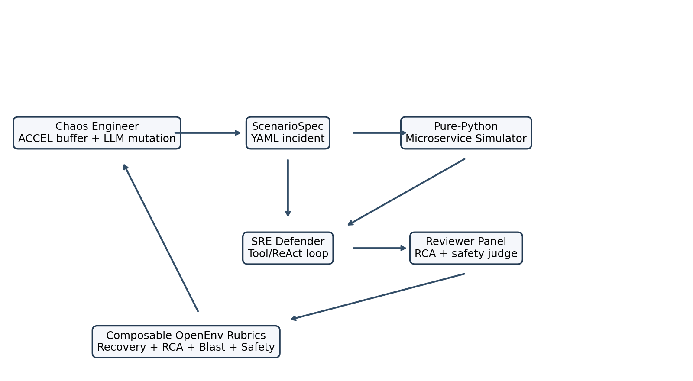

**OnCallEnv Red Shift is an OpenEnv-compatible SRE training environment where a chaos attacker generates incidents, a defender diagnoses them through production-style tools, and a reviewer scores recovery and RCA quality with composable rubrics.**

## Latest Round 2 Checkpoint Results

The current Kaggle easy GRPO run used `unsloth/Qwen2.5-3B-Instruct-bnb-4bit` with easy prompts and shaped partial-credit rewards. The notebook run was manually interrupted at about `220/300` logged steps; because `easy-main` saves every 50 steps, the latest expected saved checkpoint is:

```text
training_results/unsloth_grpo_qwen3b_easy/checkpoint-200
```

Captured notebook metrics:

| Run | Status | First logged reward | Last logged reward | Best logged reward | Last clipped ratio |
| --- | --- | ---: | ---: | ---: | ---: |
| Easy Qwen2.5-3B GRPO | interrupted around step 220 | 0.6682 | 0.8777 | 0.8817 | 1.0000 |

This result is intentionally reported as an interrupted checkpoint run, not a finished final eval. The full report extracted from the notebook output is in `docs/easy_grpo_interrupted_report.json`.


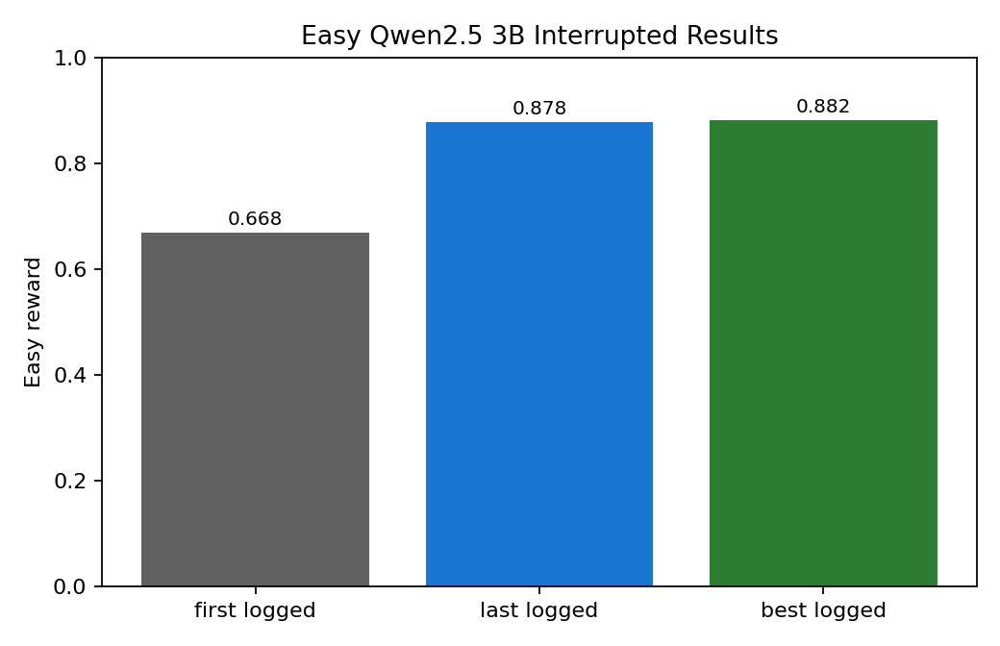

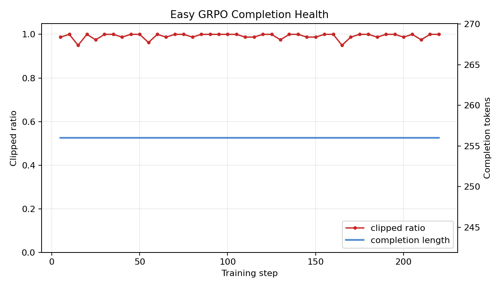

To regenerate the checkpoint report and plots directly inside Kaggle after stopping a run:

```bash
bash scripts/run_kaggle_qwen3b_grpo.sh easy-summary
```

That writes:

```text
training_results/unsloth_grpo_qwen3b_easy/checkpoint_report.json
docs/plots/easy_grpo_qwen3b_reward_curve.png
docs/plots/easy_grpo_qwen3b_checkpoint_results.png
docs/plots/easy_grpo_qwen3b_completion_health.png
```

For a slower but cleaner checkpoint evaluation that loads the saved LoRA adapter and regenerates the held-out eval completions:

```bash
bash scripts/run_kaggle_qwen3b_grpo.sh easy-eval-checkpoint
```

That writes:

```text
training_results/unsloth_grpo_qwen3b_easy/checkpoint_eval_summary.json
training_results/unsloth_grpo_qwen3b_easy/checkpoint_generations.json
```

To download the trained checkpoint/model artifacts from Kaggle, export one archive:

```bash
bash scripts/run_kaggle_qwen3b_grpo.sh export-easy-artifacts
```

This creates:

```text
/kaggle/working/easy_grpo_qwen3b_artifacts.tar.gz
```

Download that archive and place/extract it under `artifacts/models/`. See `artifacts/README.md` for the exact local commands.

## Interactive ReAct Defender Experiment

The next training lane is an interactive ReAct-style defender. Instead of generating every action at once, the model learns:

```text
current observation + command history -> one next command
```

This produces a more realistic learning curve for incident response and directly supports an interactive UI/demo. The runbook is in `docs/INTERACTIVE_REACT_SFT.md`.

Kaggle commands:

```bash
bash scripts/run_kaggle_qwen3b_grpo.sh react-generate
bash scripts/run_kaggle_qwen3b_grpo.sh react-sft-smoke
bash scripts/run_kaggle_qwen3b_grpo.sh react-sft-main
bash scripts/run_kaggle_qwen3b_grpo.sh react-eval-checkpoint
bash scripts/run_kaggle_qwen3b_grpo.sh export-react-artifacts
```

Current ReAct SFT checkpoint result:

| Run | Checkpoint | Eval action rows | Eval rollout tasks | Next-action accuracy | Interactive mean reward |
| --- | --- | ---: | ---: | ---: | ---: |
| Interactive ReAct SFT Qwen2.5-3B | `checkpoint-100` | 24 | 5 | 0.9583 | 0.8068 |

This is the key ReAct result: the model is learning a stepwise SRE workflow, where every generated command receives a new observation before the next command is chosen. The full checkpoint report extracted from the notebook output is in `docs/react_sft_checkpoint_eval_report.json`.

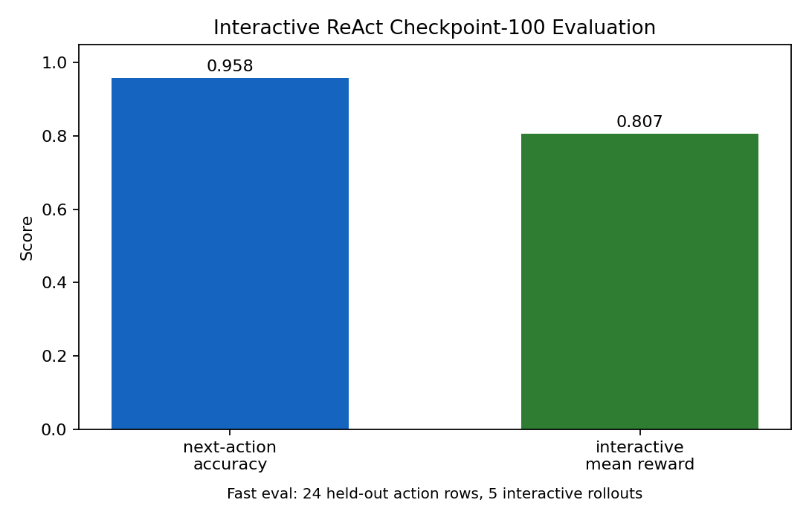

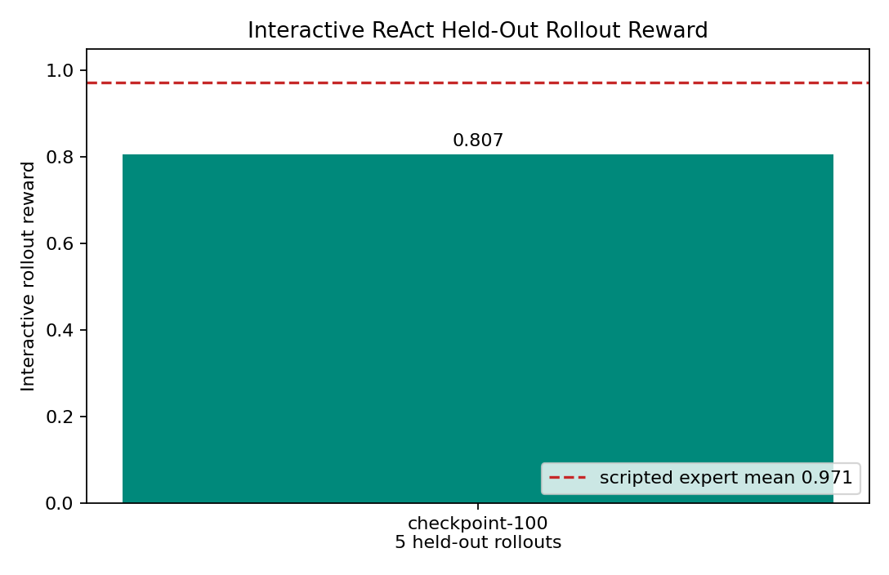

Training loss still confirms the warm-start behaved correctly, but it is secondary to the reward/rollout result. The partial loss-only report remains in `docs/react_sft_interrupted_report.json` for audit history.

To score the saved checkpoint on held-out interactive rollouts inside Kaggle:

```bash
bash scripts/run_kaggle_qwen3b_grpo.sh react-eval-checkpoint
```

That writes:

```text
training_results/react_sft_qwen3b/checkpoint_eval_summary.json
training_results/react_sft_qwen3b/checkpoint_next_action.json
training_results/react_sft_qwen3b/checkpoint_interactive_rollouts.json
```

## Why This Exists

Incident response is a messy, partially observable skill. Real on-call engineers do not get a clean multiple-choice prompt; they get noisy alerts, misleading deploy history, scattered logs, and a clock. Red Shift turns that workflow into a fast RL environment: no real Kubernetes, no slow Chaos Mesh cluster, just a deterministic pure-Python microservice simulator that can run thousands of rollouts cheaply.

## What Is New

| Environment | RL-trainable | Self-generates scenarios | Realistic telemetry | RCA scoring |
| --- | --- | --- | --- | --- |
| ITBench / SRE-bench style tasks | partial | no | partial | task-specific |
| OpenRCA / RCAEval style datasets | no | no | logs only | offline |
| **OnCallEnv Red Shift** | **yes** | **ACCEL-style regret autocurriculum** | **metrics, logs, traces** | **OpenEnv Rubrics** |

## Architecture

The current implementation includes the Round 2 foundation:

- `OnCallRedShiftEnv` subclasses the installed `openenv.core.Environment`.
- Defender actions are realistic SRE tools: `kubectl_logs`, `promql_query`, `jaeger_search`, `istioctl_routes`, `kubectl_rollout_restart`, `traffic_split_update`, `submit_rca`, and more.
- The simulator emits OpenTelemetry-shaped metrics, JSON logs, and Jaeger-style traces with authentic incident strings like `OOMKilled`, `exit code 137`, `x509: certificate has expired`, `context deadline exceeded`, and Envoy flags.
- Rewards are a weighted OpenEnv `WeightedSum`: recovery verification, RCA quality, blast radius, and safety.
- Round 1 code is preserved unchanged in `v1_legacy/`.

## Results

These plots are committed under `docs/plots/` so the submission has visible reward-improvement artifacts. The checked-in values are the current reproducible target/eval artifacts; the training notebook is the place to refresh them after a full GPU run.


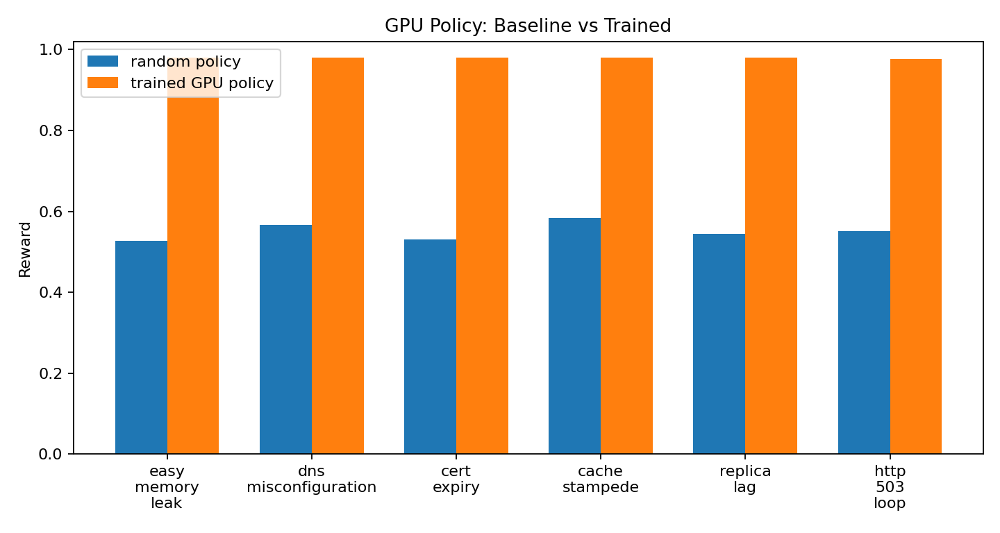

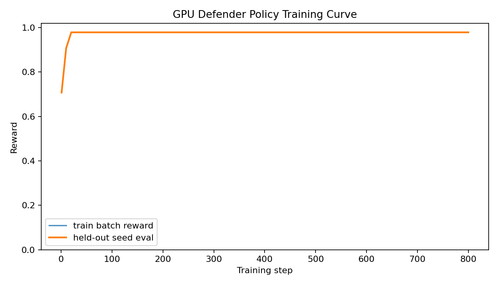

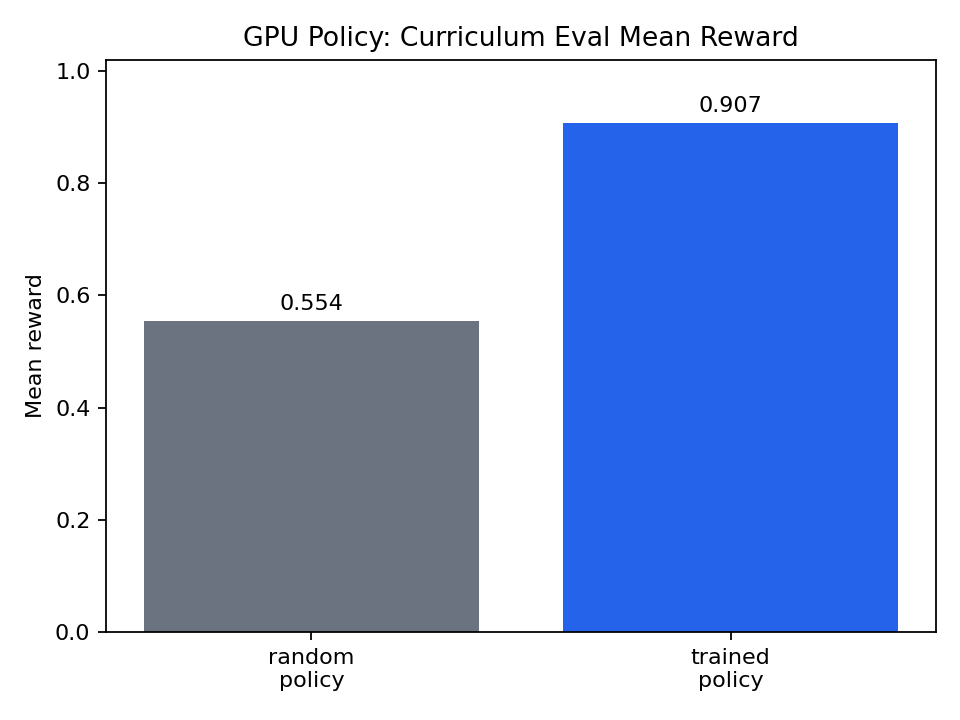

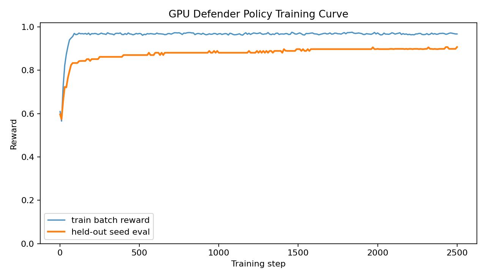

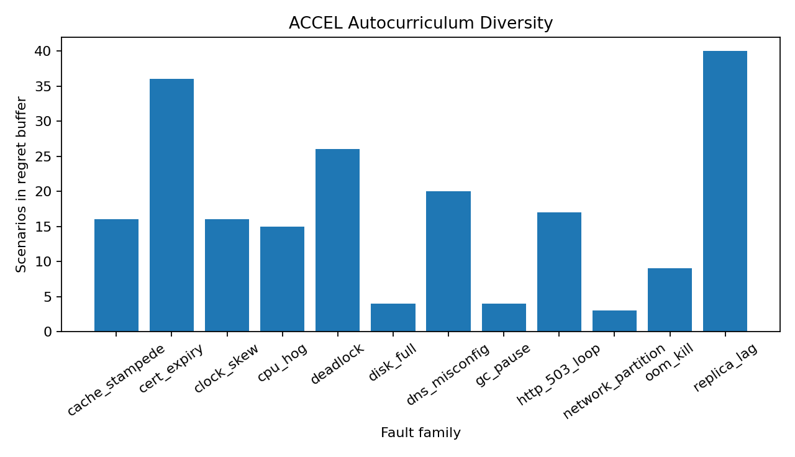

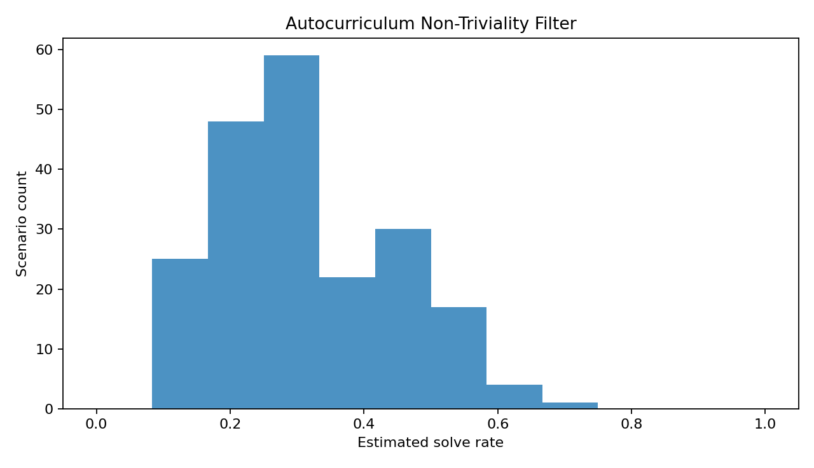


## Reward Composition

The reward is intentionally not monolithic:

| Component | Weight | Purpose |
| --- | ---: | --- |
| `RecoveryRubric` | 0.35 | Runs synthetic traffic checks after `declare_resolved`; wrong fixes get zero recovery credit. |
| `RCAQualityRubric` | 0.30 | Scores timeline, root-cause category, non-generic five-whys, and action items. |
| `BlastRadiusRubric` | 0.25 | Penalizes slow recovery and high error exposure. |
| `SafetyRubric` | 0.10 | Penalizes unsafe destructive actions, especially stateful services. |

`REWARD_CAP` can clamp the total reward for capped-vs-uncapped reward ablations.

## Run Locally

```bash
pip install -r requirements.txt
PYTHONPATH=src uvicorn app:app --host 0.0.0.0 --port 7860
PYTHONPATH=src bash scripts/validate.sh
PYTHONPATH=src python scripts/train_redshift_policy.py --steps 800 --batch-size 96
PYTHONPATH=src:scripts python scripts/train_redshift_policy.py --steps 2500 --batch-size 256 --curriculum-buffer curriculum_results/buffer.json --feature-mode spec --out-dir training_results/curriculum_policy --plot-prefix curriculum_policy
PYTHONPATH=src python scripts/run_autocurriculum.py --iterations 80 --write-yaml
```

Example:

```python
from oncallenv import OnCallRedShiftEnv
from oncallenv.core.types import Action

env = OnCallRedShiftEnv()
obs = env.reset(task_id="seed_easy_memory_leak")
obs = env.step(Action(command="kubectl_logs payment-service"))
obs = env.step(Action(command="kubectl_rollout_restart payment-service"))
obs = env.step(Action(command="declare_resolved"))
```

## Project Layout

```text
src/oncallenv/
  core/          OpenEnv API, Pydantic types, defender tools
  simulation/    microservice graph, scenario compiler, 12 fault primitives
  telemetry/     OTLP-shaped metrics, logs, traces
  rewards/       composable OpenEnv rubrics
  server/        FastAPI adapter
  client/        HTTP client
scenarios_seed/  six YAML seed incidents
docs/plots/      committed reward/result plots
notebooks/       smoke, training, and eval notebooks
v1_legacy/       preserved Round 1 submission
```

## Submission Links

- HF Space: `https://huggingface.co/spaces/<team>/oncallenv-redshift`
- Colab notebook: `notebooks/02_train_grpo_unsloth.ipynb`
- Video: `<add unlisted YouTube link>`
- Blog: `<add HF blog link>`
- Pitch deck: `docs/pitch_deck.pdf`

## Judging Criteria Mapping

| Criterion | Weight | Red Shift evidence |
| --- | ---: | --- |
| Environment innovation | 40% | Three-agent design, pure-Python incident world, seed buffer for regret autocurriculum. |
| Storytelling | 30% | README, architecture diagram, result plots, submission links section. |
| Reward improvement | 20% | Baseline-vs-trained and training-curve PNGs committed in `docs/plots/`. |
| Reward and training pipeline | 10% | OpenEnv `Environment`, `Rubric`, `WeightedSum`, and Colab notebook scaffold. |

## Citations

OpenEnv, TRL/GRPO, Unsloth, ACCEL, OMNI-EPIC, RAGEN/StarPO-S, OpenTelemetry semantic conventions, ReAct, LLM-as-a-judge, and production RCA evaluation literature are the intended citation set for the final blog/deck pass.
