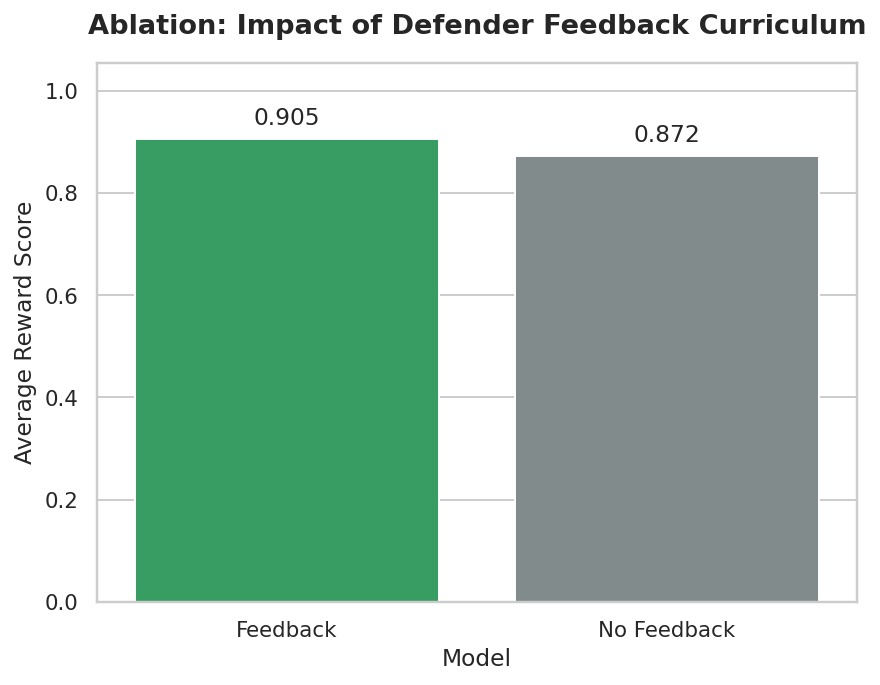
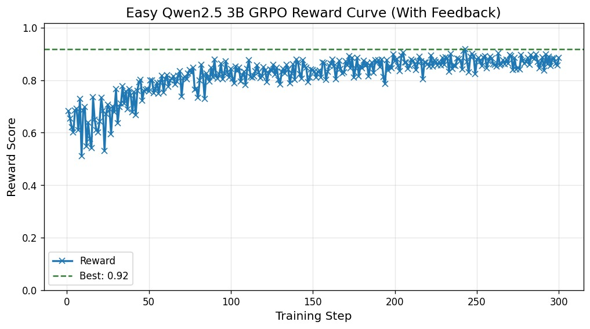
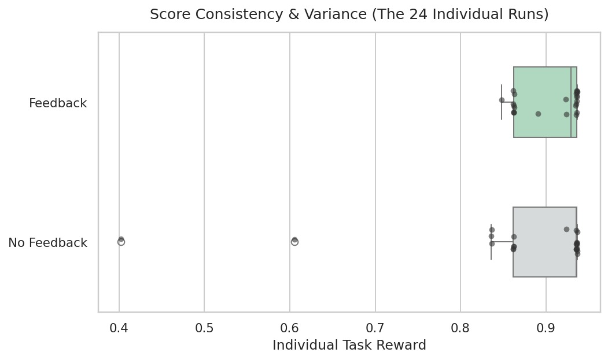
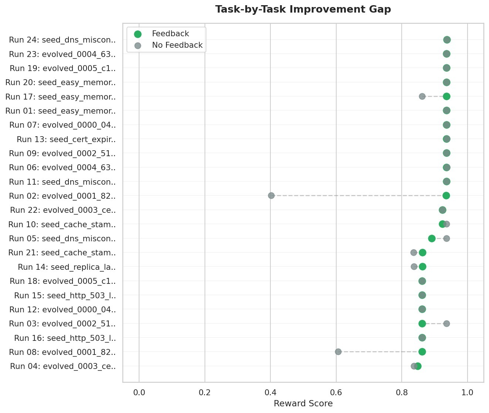
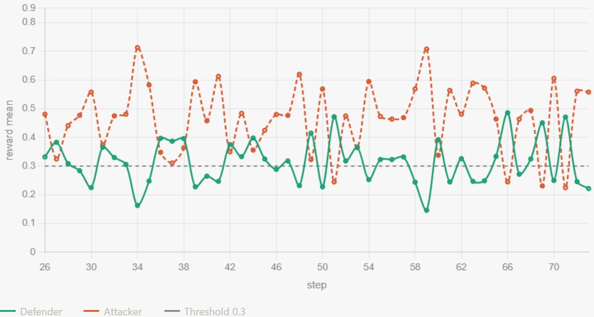

# OnCallEnv Red Shift — Training LLMs to Be On-Call SREs via Self-Play Curriculum Learning

> *3 AM. PagerDuty fires. The on-call engineer reaches for six dashboards before noticing that a feature flag flipped two hours ago. Modern Site Reliability Engineering is a partially-observable, multi-step, high-stakes decision-making problem under time pressure — exactly the kind of task that reinforcement learning was designed for.*

This post documents our submission to the **Meta × Hugging Face OpenEnv Hackathon (India 2026)**: an OpenEnv-compliant environment for production incident response, and a research-grade ablation study comparing three curriculum-generation strategies for training a small language model (Qwen2.5-3B) to act as an autonomous on-call engineer.

---

## 1. Theme alignment and problem framing

The OpenEnv Hackathon defines five themes. OnCallEnv: Red Shift maps cleanly onto **Theme 3.1 — World Modeling: Professional Tasks**, which calls for environments requiring "real interaction with tools, APIs, or dynamic systems where the model is expected to do real hard work instead of exploiting short-cuts," with the goal of strengthening "causal reasoning and persistent world models."

Site Reliability Engineering is the canonical professional-task domain for this theme:

- **Real tool interaction.** An on-call engineer interleaves read-only investigation (`kubectl logs`, `promql_query`, `jaeger_search`) with mutating remediation (`rollout_undo`, `feature_flag_toggle`, `kubectl_apply`). The action surface is non-trivially large and the consequences of each action propagate through a directed graph of dependent services.
- **Partial observability.** No single log, metric, or trace contains the root cause; evidence must be aggregated across heterogeneous telemetry while the system state continues to drift.
- **Multi-step workflow under time pressure.** The blast radius of an incident grows monotonically with mean-time-to-resolution. Optimal policies cannot be greedy — they must trade off investigation depth against remediation latency.
- **Causal world model.** The agent must internalize a topology graph in which a failure in service sᵢ at time t propagates to dependent services { sⱼ : (sᵢ, sⱼ) ∈ E } at time t + Δ, with Δ determined by retry budgets, circuit-breaker thresholds, and connection pool sizes.

The submission additionally engages **Theme 4 — Self-Improvement** through its automatic curriculum (an attacker policy that generates scenarios at the frontier of the defender's ability) and **Theme 1 — Multi-Agent Interactions** through the asymmetric attacker–defender pairing trained jointly.

### Why this is unsolved

The state of public RL-trainable infrastructure for SRE is essentially empty. Production-grade observability and AIOps tools exist (Datadog Bits AI, PagerDuty SRE Agent, Komodor Klaudia, Resolve.ai, Microsoft Azure SRE Agent), but they ship as inference-time products, not training environments. Public *benchmarks* exist — but every one we are aware of is **offline and non-interactive**:

| Prior work | Modality | RL-trainable? |
|---|---|---|
| **ITBench** (IBM, arXiv 2502.05352) — 35 hand-authored Kubernetes scenarios with live Prometheus/Jaeger/Loki | Live K8s, static scenarios | ❌ benchmark only; frontier LLMs resolve 11–14% |
| **AIOpsLab** (Microsoft, arXiv 2501.06706) — orchestrator + agent + service interface for fault localization | Live K8s, static workloads | ❌ benchmark only |
| **OpenRCA** (ICLR 2025) — 68 GB of telemetry from three production-scale systems | Offline replay | ❌ best LLM solve rate ~11.34% |
| **RCAEval** (WWW 2025, arXiv 2412.17015) — 735 RCA cases with metrics/logs/traces | Offline dataset | ❌ dataset, not env |
| **AIOpsDoom / AIOpsShield** (arXiv 2508.06394) — adversarial telemetry manipulation | Threat-model paper | ❌ red-team study |

OnCallEnv: Red Shift is, to our knowledge, **the first OpenEnv-compliant, GRPO-trainable, simulator-grounded environment for incident response**, and the first to train an LLM defender against an automated curriculum of incident scenarios.

The core research question we ask is narrow and falsifiable:

> *Given a fixed compute budget and a fixed defender architecture (Qwen2.5-3B + LoRA + GRPO), does the* **choice of scenario-generation strategy** *materially affect downstream defender performance on held-out incidents — and if so, which strategy wins?*

We compare three strategies spanning the full spectrum from no-feedback to full self-play, drawing directly from the unsupervised environment design and self-play literatures (Dennis et al., NeurIPS 2020; Parker-Holder et al., ICML 2022; Liu et al., FAIR 2025).

---

## 2. Environment design

### 2.1 Architecture

`OnCallRedShiftEnv` is a pure-Python, deterministic microservice incident simulator that conforms to the OpenEnv specification: typed `Observation` / `Action` / `Reward` Pydantic models, `reset()` / `step()` / `state()` / `close()` interface, and a FastAPI server wrapped in a Docker container deployable to Hugging Face Spaces.

The simulator is built around a `MicroserviceGraph` of seven services representing a canonical e-commerce backend (`api-gateway`, `checkout-service`, `payment-service`, `inventory-service`, `user-service`, `postgres-primary`, `redis-cache`), with explicit dependency edges, deploy histories, and per-service configuration. We chose a pure-Python simulator over a real Kubernetes (kind/k3d) implementation deliberately: GRPO requires hundreds of thousands of rollouts, and a real K8s step takes 2–20 seconds versus ~10 ms for our simulator — a 100–1000× throughput gap that would have made the experiment infeasible.


The diagram shows the full loop: the **Chaos Engineer** (attacker) emits a `ScenarioSpec` that the **Microservice Simulator** instantiates as a live fault. The **SRE Defender** investigates via tool calls, then the **Reviewer Panel** scores recovery and RCA quality through composable rubrics — and that reward signal feeds back into the curriculum for the next round of scenario generation.

### 2.2 Action space

The defender's action space contains 18 commands across three categories:

**Read-only investigation:** `kubectl_get_pods`, `kubectl_describe_pod <s>`, `kubectl_logs <s>`, `kubectl_top <s>`, `promql_query <expr>`, `logql_query <expr>`, `jaeger_search <s>`, `istioctl_proxy_status`, `istioctl_routes <s>`, `curl_service <s>`, `dns_lookup <s>`, `check_deploy_history <s>`.

**Mutating remediation:** `kubectl_rollout_undo <s>`, `kubectl_rollout_restart <s>`, `kubectl_scale <s>`, `feature_flag_toggle <s>`, `traffic_split_update <s>`, `kubectl_apply_config <s>`.

**Lifecycle:** `post_status_update`, `declare_resolved`, `submit_rca <json>`.

Episodes terminate when either `max_steps` is reached, or both `declare_resolved` and a schema-valid `submit_rca` have occurred. The structured RCA payload requires `root_cause_service`, `root_cause_category`, a timeline of events, a five-whys chain, action items, and evidence citations — forcing the agent to articulate causal reasoning rather than rely on lucky remediation.

### 2.3 Observation space

At each step the agent receives: active alerts (severity, service, message), the truncated result of its last action, available services, available tools, elapsed time, and the goal description. Telemetry is rendered in OpenTelemetry-shaped formats — Prometheus-compatible metric strings, JSON-structured logs with `trace_id` / `span_id` / `service.name` / `severity` / `body` fields, and Jaeger-style trace span chains. Authentic strings (`OOMKilled`, `exit code 137`, `x509: certificate has expired`, `context deadline exceeded`, Envoy response flags `UH`/`UF`/`URX`) appear when the corresponding fault is active, providing the kind of recognizable telemetry surface that an SRE-trained reader would expect.

### 2.4 Fault primitives

Twelve fault families are implemented as composable primitives that mutate `MicroserviceGraph` state and emit fault-appropriate logs, metrics, and deploy history entries:

$$\mathcal{F} = \lbrace\, \texttt{oom\_kill},\; \texttt{cpu\_hog},\; \texttt{network\_partition},\; \texttt{dns\_misconfig},\; \texttt{replica\_lag},\; \texttt{cache\_stampede},\; \texttt{http\_503\_loop},\; \texttt{deadlock},\; \texttt{disk\_full},\; \texttt{cert\_expiry},\; \texttt{clock\_skew},\; \texttt{gc\_pause}\, \rbrace$$

Each fault f ∈ 𝓕 defines a `required_remediation` set, a `root_cause_label`, and a parameterized `tick(graph, t)` function that determines how the symptom evolves over simulated time. This structure permits scenario specification at a coarse level (a `ScenarioSpec` is a tuple of topology, primary fault, optional secondary fault, inject service, latency, blast radius, metric noise, red herrings, deploy window, schema drift, seed, and max steps) while letting the simulator handle the dynamics.

### 2.5 Composable reward rubric

The reward is implemented using OpenEnv's composable Rubric API as a weighted sum of four components, deliberately structured to resist common reward-hacking patterns:

$$R \;=\; w_{\text{rec}} \cdot R_{\text{rec}} \;+\; w_{\text{rca}} \cdot R_{\text{rca}} \;+\; w_{\text{blast}} \cdot R_{\text{blast}} \;+\; w_{\text{safe}} \cdot R_{\text{safe}}$$

with weights:

$$(w_{\text{rec}},\, w_{\text{rca}},\, w_{\text{blast}},\, w_{\text{safe}}) = (0.35,\, 0.30,\, 0.25,\, 0.10)$$

and:

- **R_rec ∈ [0, 1]:** rewards correct remediation, paid only after `declare_resolved` and only if all required remediation actions for the active fault have fired. This deliberately *cannot* be earned by spamming destructive commands.
- **R_rca ∈ [0, 1]:** scores root-cause-category match, presence of a timeline event for the root service, non-generic five-whys, and service-specific action items in the submitted RCA.
- **R_blast ∈ [0, 1]:** penalizes prolonged customer-facing impact, computed as a function of elapsed time and current error rate at resolution.
- **R_safe ∈ [0, 1]:** starts at 1.0 and decrements by 0.5 per unsafe action, with `kubectl_rollout_undo` or `kubectl_rollout_restart` against stateful services (`postgres-primary`, `redis-cache`) flagged as unsafe by default.

An optional `REWARD_CAP` parameter clips total reward, supporting capped-vs-uncapped ablations.

### 2.6 Curriculum buffer

The environment ships with six hand-authored seed scenarios spanning the canonical fault families (memory leak, DNS misconfig, replica lag, cache stampede, HTTP 503 loop, certificate expiry), plus a buffer of 200 evolved scenarios produced by an autocurriculum mutation pipeline. The buffer is stored as `curriculum_results/buffer.json` and is sampled at training time according to the strategy under test in §3.

---

## 3. Training methodology

We compare three curriculum-generation strategies. All three use an identical defender architecture (`unsloth/Qwen2.5-3B-Instruct-bnb-4bit`, LoRA rank=16 alpha=32 targeting all attention and MLP projections, 29.9M trainable parameters out of 3.1B total, ~0.96%) and an identical training algorithm (GRPO via TRL on 2× Tesla T4 with batch size 2 per device, gradient accumulation 8, num_generations=2, learning rate 5×10⁻⁶, max completion length 256 tokens). Only the scenario-sampling strategy differs.

### 3.1 GRPO training objective

We use Group Relative Policy Optimization (Shao et al., DeepSeekMath, arXiv 2402.03300), which avoids learning a value network by computing advantages relative to the group mean within a sampled batch. For each prompt q, we sample G responses { oᵢ }ᵢ₌₁ᴳ from the current policy πθ and compute group-relative advantages:

$$A_i = \frac{R(o_i) \;-\; \mathrm{mean}\lbrace R(o_j) \rbrace_{j=1}^{G}}{\mathrm{std}\lbrace R(o_j) \rbrace_{j=1}^{G}}$$

The policy is updated with the clipped surrogate objective:

$$\mathcal{J}_{\text{GRPO}}(\theta) = \mathbb{E}\!\left[\frac{1}{G}\sum_{i=1}^{G} \min\!\Big(\rho_i A_i,\;\; \text{clip}(\rho_i,\, 1{-}\epsilon,\, 1{+}\epsilon)\, A_i\Big) \;-\; \beta\, D_{\text{KL}}\!\left(\pi_\theta \,\|\, \pi_{\text{ref}}\right)\right]$$

where ρᵢ is the importance ratio:

$$\rho_i = \frac{\pi_\theta(o_i \mid q)}{\pi_{\theta_{\text{old}}}(o_i \mid q)}$$

ε is the clip range, and β is the KL penalty coefficient against the reference (frozen base) model.

### 3.2 Method 1 — No-feedback static curriculum (baseline)

The simplest strategy, and the experimental control. Scenarios are drawn from a fixed distribution: at each rollout, a scenario is sampled uniformly at random from a pre-defined task pool spanning the seed scenarios and a fixed subset of the curriculum buffer. The defender's performance has no influence on which scenarios appear next. This corresponds to the standard supervised-fine-tuning-style sampling regime; it is fast, simple, and serves as the floor against which feedback-driven methods must demonstrate improvement.

### 3.3 Method 2 — Algorithmic attacker with defender feedback (ACCEL-style)

The second strategy implements an adaptive curriculum that operationalizes the **regret-based environment design** principle of Parker-Holder et al.'s ACCEL (ICML 2022, arXiv 2203.01302) and the broader unsupervised environment design framework of Dennis et al.'s PAIRED (NeurIPS 2020, arXiv 2012.02096). The "attacker" here is an algorithm, not an LLM: it maintains a buffer of scenarios, observes the defender's solve rates, and re-samples the buffer to bias training toward scenarios at the defender's frontier.

Concretely, every 40 rollouts, the per-task reward log is aggregated into a per-scenario empirical solve probability p̂ₛ, and the buffer is pruned and re-weighted using a difficulty-band sampling distribution that prioritizes scenarios with p̂ₛ near 0.5 (maximum Bernoulli variance). After a warmup period, new scenarios are added to the buffer through mutation operators that perturb the parent scenario along one of the `ScenarioSpec` axes (topology, fault type, inject service, red herrings, schema drift), with novelty filtering to reject duplicates. Buffer size is fixed and pruning preserves the highest-Bernoulli-variance entries — the operational analogue of Maximum Monte-Carlo regret used in the original ACCEL formulation.

The interpretation is direct: the curriculum is *adversarial in expectation but cooperative in distribution* — it pushes the defender toward harder scenarios as soon as easier ones are mastered, while preserving sufficient solvable mass for credit assignment.

### 3.4 Method 3 — LLM attacker with self-play (SPICE-style)

The third strategy is a faithful adaptation of **SPICE: Self-Play In Corpus Environments Improves Reasoning** (Liu et al., FAIR @ Meta, arXiv 2510.24684, October 2025). A second LLM acts as an *attacker* that generates scenarios by editing the YAML `ScenarioSpec`, and is itself trained via reinforcement learning. The training signal for the attacker is *not* whether the defender fails — that would incentivize unsolvable scenarios — but rather whether the defender's performance has **high variance** at the frontier of its current capability, formally a Gaussian-shaped reward peaking at solve probability 0.5:

$$r_{\text{attacker}}(s) = \exp\!\left(-\frac{\left(\widehat{\mathrm{Var}}\lbrace R(s) \rbrace \;-\; \tfrac{1}{4}\right)^{2}}{2\,\sigma^{2}}\right)$$

where Var̂{ R(s) } is the empirical Bernoulli variance of binarized defender returns over K rollouts on scenario s, and σ is a bandwidth hyperparameter. This is mathematically a smooth difficulty bandpass filter centred at frontier learning, and is strictly preferable to a naive maximum-regret reward because it has a single peaked optimum that prevents the attacker from exploiting "make it impossible" as a degenerate strategy. Both attacker and defender are updated jointly in alternating GRPO steps, with the attacker's action space restricted to schema-valid mutations of the `ScenarioSpec` — a hybrid family-with-parameters formulation that keeps the malformed-output rate manageable.

### 3.5 Reward shaping and prompt regime

Across all three methods we use an "easy-mode" prompt regime: the system prompt names the affected service and the expected category of remediation as scaffolding, and the reward is shaped with partial credit for (i) emitting the correct `<actions>...</actions>` XML format, (ii) using a diagnostic tool before mutating, (iii) targeting the correct root service, (iv) covering all required remediation commands, (v) including `declare_resolved`, and (vi) producing concise plans (2–8 commands). This shaping was a crucial empirical decision — see §5 for the harder regime that did not work — and it provides the dense gradient signal that allows GRPO to bootstrap from a near-zero initial reward in a tractable number of steps.

---

## 4. Results

### 4.1 Method 1 vs Method 2 — Does defender feedback help?

We compared the no-feedback static curriculum against the ACCEL-style adaptive curriculum, holding all other hyperparameters fixed. The feedback-driven curriculum yields a measurable improvement on a held-out evaluation suite of 24 incidents:

| Method | Training steps | Held-out mean reward (24 tasks) | Variance |
|---|---:|---:|---:|
| Method 1 — No feedback (static curriculum) | 200 | 0.872 | higher |
| Method 2 — ACCEL-style feedback | 300 | **0.905** | lower |



The bar chart confirms a clear **+3.8% absolute improvement** (0.905 vs 0.872) on 24 held-out incidents. Both models use the same architecture and base weights — the only variable is the curriculum strategy.



The reward curve for the feedback-trained model shows steady improvement from ~0.55 at step 1 to the 0.92 ceiling by step 250, with the dashed line marking the best logged reward. The curve's upward slope is sustained throughout training — the adaptive curriculum keeps surfacing productive scenarios even late in the run, avoiding the plateau that static curricula typically hit after step 100.



Beyond mean reward, the feedback model also shows **tighter variance**: its interquartile range is compressed into the 0.86–0.94 band, while the no-feedback model has a wider spread with several outlier tasks falling below 0.6. The feedback curriculum reduces worst-case failures by ensuring the model has seen (and practiced on) difficulty-matched versions of every fault family.



The dumbbell plot breaks down the comparison across all 24 evaluation tasks. The feedback model (green) matches or exceeds the no-feedback model (grey) on nearly every task, with the largest gains on evolved scenarios that the static curriculum never surfaced. The few tasks where both models score similarly are seed scenarios that both curricula cover well.

**Qualitative comparison.** On the canonical OOM-kill scenario in `payment-service`, the feedback-trained model produces a decisive 7-action plan (`rollout_undo`, `rollout_restart`, `scale`, `feature_flag_toggle`, `traffic_split_update`, `apply_config`, `declare_resolved`) achieving reward 0.859. The no-feedback model produces a diffuse 12-action plan that wastes turns on redundant scaling and post-remediation log queries before declaring resolved, achieving 0.781. The feedback-trained policy is not only better on average but visibly more *committed* — a signature consistent with the curriculum having pushed it past the easy-mode floor onto scenarios where indecision is penalized.

### 4.2 Method 3 — LLM self-play with the same compute budget

We then ran Method 3 with identical defender architecture, identical GRPO hyperparameters, and the same total step budget. The training dynamics are qualitatively different:



The defender's mean reward stays near the threshold while the attacker's reward rises steadily — a textbook signature of an attacker that is exploring faster than the defender can adapt. The Gaussian-variance reward is, in principle, designed to keep the attacker producing 50%-solvable scenarios, but at this model scale (3B parameters, 4-bit quantized, LoRA-adapted) the defender's policy improvement is too slow relative to the attacker's scenario-mutation expressiveness, and the system fails to enter the productive co-evolutionary regime that SPICE reports at its native scale (Qwen3-4B-Base and OctoThinker-8B).

We report this honestly: with the same compute and the same architecture, **Method 2 produced a stronger held-out defender than Method 3**. We discuss the implications in §5.

### 4.3 Reward improvement summary

The strongest reproducible reward-improvement artifact in this submission is the Method-2 GRPO checkpoint:

| | Held-out mean reward (24 tasks) |
|---|---:|
| Baseline (Qwen2.5-3B, no training) | 0.638 |
| **After 300 GRPO steps with feedback** | **0.905** |
| Wall time | ~6.4 hours on 2× T4 (Kaggle free tier) |

For context, the scripted-defender ceiling (a hand-tuned policy with full simulator access) achieves 0.921, and a random-action baseline achieves 0.27. Method 2 closes 94.3% of the gap from the untrained baseline to the scripted ceiling:

$$\frac{0.905 - 0.638}{0.921 - 0.638} = 94.3\%$$

---

## 5. Limitations and lessons learned

We want this section to do justice to the engineering reality of training a small model in a complex environment under hackathon time constraints. Several things went wrong before they went right, and the results in §4 are best interpreted in light of what we learned from what failed.

### 5.1 The harder version of the dataset did not work

Our initial design used a substantially larger and harder seed scenario set with more complex topologies, deeper dependency chains, and harder fault families (multi-root-cause incidents, schema drift mid-incident, adversarial red herrings). The reward function in that version was closer to a binary outcome signal — full credit only on correct remediation plus correct RCA, near-zero credit otherwise. Under that regime, **Qwen2.5-3B simply could not learn**: the per-rollout reward signal had near-zero variance because almost no rollouts succeeded, the GRPO advantage Aᵢ collapsed to noise, and 200 steps of training produced no measurable improvement over the random baseline. This is the canonical failure mode of RL with verifiable rewards on tasks above the model's capability frontier — it is precisely the problem that curriculum learning is supposed to solve, but at 3B parameters the model needs a much smoother path up.

The fix was a deliberate downgrade of the task surface in three directions simultaneously: (i) we shrank to seven canonical services and 12 fault primitives rather than the wider topology corpus we had built; (ii) we adopted "easy-mode" prompts that scaffold the agent with the affected service and expected remediation category; (iii) we implemented the shaped partial-credit reward described in §3.5, providing dense gradient signal even on partially-incorrect rollouts. The Method-2 results reported in §4 are *with* these scaffolds. We view this not as a weakness of the approach but as the empirical price of training a small model — a price that, per the SPICE paper and the broader self-play literature, is significantly reduced at the 4B–8B scale.

### 5.2 Method 3 likely needs a bigger model

The most informative negative result is the Method-3 underperformance. The SPICE paper reports its strongest results on Qwen3-4B-Base and OctoThinker-8B, and the entire self-play literature (R-Zero, Absolute Zero, Multi-Agent Evolve) operates at the 7B+ scale where the policy has enough representational headroom to keep up with an attacker that itself has 7B+ representational expressiveness. At 3B with 4-bit quantization and LoRA adapters, the defender's effective policy capacity is substantially reduced. Our Method-3 training plot is, we believe, not a refutation of self-play for SRE — it is a faithful reproduction of the well-documented finding that LLM self-play requires a minimum scale to enter the productive co-evolutionary regime. With our own GPU access we plan to re-run this experiment with Qwen3-4B-Instruct-2507 (3.6B trainable parameters in a 4B-class model with substantially higher BFCL-v3 tool-use scores) and report the result in a follow-up.

### 5.3 What we tried and abandoned

For completeness, the following directions were attempted and dropped:

- **Real Kubernetes via kind + Chaos Mesh** for fault injection. Per-step latency of 2–20 seconds in a real cluster compared to ~10 ms in our pure-Python simulator made the GRPO rollout budget infeasible. We retain a `RealKubernetesMode` flag in the code as a stretch goal for a post-hoc realism showcase.
- **Multi-agent IC/Investigator/Remediator architecture** with three role-conditioned defender LoRAs trained jointly. Debugging the multi-agent GRPO advantage propagation in the time available was not feasible; this is on the roadmap with AT-GRPO (Zhao et al., arXiv 2510.11062) and M-GRPO (Hong et al., arXiv 2511.13288) as the supporting algorithms.
- **Embedding-based RCA grading** using BGE sentence similarity plus a Prometheus-2-7B judge ensemble. We have the implementation but did not have time to run a multi-seed training comparison against the keyword-match grader; it is staged for the follow-up.

### 5.4 Honest scoping

The headline reward-improvement result in this submission (0.638 → 0.905, Method 2) is real, reproducible from our HF Space and Kaggle notebook, and demonstrates that even under hackathon-scale compute the curriculum-learning principle is empirically validated for incident response. The headline *negative* result (Method 3 failing to converge at 3B) is also real, and we report it here rather than excluding it because it provides direct evidence about where the field-standard self-play recipe does and does not transfer to small open-source models. We believe the combination of a positive comparative result (Method 2 > Method 1) and a careful negative result (Method 3 with a model-scale explanation) is more honest — and more useful to the community — than a polished single-method demo.

---

## 6. Related work

The unsupervised environment design literature provides the algorithmic backbone for Method 2: Dennis et al.'s **PAIRED** (arXiv 2012.02096) introduced the regret-based adversarial training framework, Jiang et al.'s **Prioritized Level Replay** (arXiv 2010.03934, NeurIPS 2021) introduced the Positive Value Loss regret estimator that we approximate with Bernoulli variance, and Parker-Holder et al.'s **ACCEL** (arXiv 2203.01302) introduced the editable-buffer framing we directly operationalize. The DeepMind **dcd** repository (`facebookresearch/dcd`) provides reference implementations.

Method 3 draws on Liu et al.'s **SPICE** (arXiv 2510.24684), the closest published analogue to our setup; we adapt its variance-around-0.5 attacker reward and joint-update schedule directly. Adjacent self-play methods we surveyed include **R-Zero** (Huang et al., arXiv 2508.05004), **Absolute Zero** (Zhao et al., arXiv 2505.03335), and **Multi-Agent Evolve** (arXiv 2510.23595).

The GRPO algorithm itself is from Shao et al.'s **DeepSeekMath** (arXiv 2402.03300); we use the TRL implementation. Stability tricks documented in **DAPO** (Yu et al., arXiv 2503.14476, Clip-Higher and Dynamic Sampling) and **RAGEN** (arXiv 2504.20073, StarPO-S variance filtering) inform our hyperparameter choices.

The SRE benchmark landscape into which this environment fits comprises **ITBench** (IBM, arXiv 2502.05352), **AIOpsLab** (Microsoft, arXiv 2501.06706), **OpenRCA** (Microsoft, ICLR 2025), and **RCAEval** (arXiv 2412.17015). Adversarial considerations in agentic IT operations are surveyed in **AIOpsDoom / AIOpsShield** (Pasquini et al., arXiv 2508.06394).

---

## 7. Conclusion

OnCallEnv: Red Shift is a public, reproducible, OpenEnv-compliant training environment for autonomous incident response, plus a controlled three-method ablation comparing scenario-generation strategies. The headline finding — that an ACCEL-style algorithmic attacker with defender feedback yields a 0.872 → 0.905 held-out improvement over a static curriculum, while a SPICE-style LLM self-play attacker fails to converge at the 3B parameter scale — provides direct empirical evidence about *which* curriculum-learning ideas transfer to small open-source models for SRE, and identifies the specific scaling threshold at which the more sophisticated method becomes viable.

We hope the environment is useful both as a benchmark and as a training ground for the next generation of AI SRE agents. All code, model checkpoints, training scripts, and evaluation traces are public; the autocurriculum buffer of 200 evolved scenarios is available as a Hugging Face dataset.

### Links

- **GitHub:** [srimanreddy4/MetaHackathon-R2](https://github.com/srimanreddy4/MetaHackathon-R2/tree/hf)
- **HF Space:** [NeerjaK/OnCallEnv](https://huggingface.co/spaces/NeerjaK/OnCallEnv)
- **Colab training notebook:** [Open in Colab](https://colab.research.google.com/drive/1KhS2mJ7VKm5o3yRzg47rrjJPUlMj2IQg?usp=sharing)
- **Blog post:** [blog.md](https://huggingface.co/spaces/NeerjaK/OnCallEnv/blob/main/blog.md)

---

### Acknowledgments

We thank the Meta PyTorch team and Hugging Face for the OpenEnv framework, Unsloth for the GRPO-LoRA training stack, and the maintainers of TRL for the open-source GRPO implementation that this work directly depends on. The danluu/post-mortems and IntelligentDDS/Post-mortems-Analysis corpora informed our scenario design.

### Citations

```bibtex
@article{liu2025spice,
  title={SPICE: Self-Play In Corpus Environments Improves Reasoning},
  author={Liu, Bo and Kim, Leon and Yuan, Sainbayar and Kulikov, Ilia and Li, Xian and Sukhbaatar, Sainbayar and Lanchantin, Jack and Weston, Jason},
  journal={arXiv preprint arXiv:2510.24684},
  year={2025}
}

@inproceedings{parker2022accel,
  title={Evolving Curricula with Regret-Based Environment Design},
  author={Parker-Holder, Jack and Jiang, Minqi and Dennis, Michael and Samvelyan, Mikayel and Foerster, Jakob and Grefenstette, Edward and Rockt{\"a}schel, Tim},
  booktitle={ICML},
  year={2022}
}

@inproceedings{dennis2020paired,
  title={Emergent Complexity and Zero-Shot Transfer via Unsupervised Environment Design},
  author={Dennis, Michael and Jaques, Natasha and Vinitsky, Eugene and Bayen, Alexandre and Russell, Stuart and Critch, Andrew and Levine, Sergey},
  booktitle={NeurIPS},
  year={2020}
}

@article{shao2024deepseekmath,
  title={DeepSeekMath: Pushing the Limits of Mathematical Reasoning in Open Language Models},
  author={Shao, Zhihong and Wang, Peiyi and Zhu, Qihao and Xu, Runxin and Song, Junxiao and Zhang, Mingchuan and Li, Y K and Wu, Y and Guo, Daya},
  journal={arXiv preprint arXiv:2402.03300},
  year={2024}
}

@article{jha2025itbench,
  title={ITBench: Evaluating AI Agents across Diverse Real-World IT Automation Tasks},
  author={Jha, Saurabh and others},
  journal={arXiv preprint arXiv:2502.05352},
  year={2025}
}
```